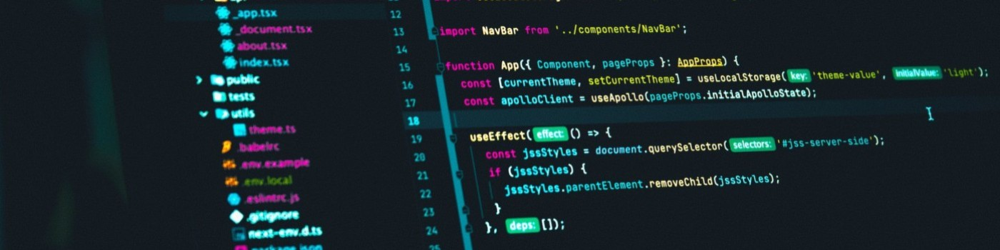

---

<h1 align="center">Daniel Peixoto 👾</h1>

###

## 🙋🏿‍♂️ Sobre mim

###
**`Desenvolvedor Front-End`**

Oi, meu nome é Daniel, tenho 21 anos e sou apaixonado por tecnologia e desenvolvimento web, crio interfaces modernas e responsivas, focadas na melhor experiência do usuário. Atualmente, estou aprimorando minhas habilidades de back-end com Python/Django e SQL.

###

## 🏆 GitHub Stats 

###

  
  

---

## 🧠 Technologies

###

### 💻 Languages:

###

### 🛠️ Frameworks:

###

### 🧰 Tools:

###

### 💾 Databases:

###

### 🌐 Hosting:

###

### ⚙️ Operating Systems:

---

### 🤝 Connect with me!

###

  

###

